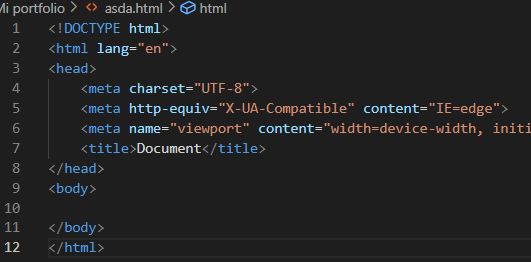

# HTML 5

El **Lenguaje de Marcado de Hipertexto (HTML)** es el código que se utiliza para estructurar y desplegar una página web y sus contenidos.

Puede ser representado mediante un **árbol** cuya información se encapsula entre las diferentes etiquetas


# Buenas prácticas

* Empezar todos los **script html** con:
```
<!DOCTYPE html>
```



> NOTA: A partir de la versión HTML 5, al escribir esta línea, automáticamente el intérprete del navegador entiende que debe trabajar con la última versión

* Dentro de los metadatos, **importante especificar el idioma, los caracteres de ASCII correspondientes y la zona**:

```
<meta charset="UTF-8">
```

* Especificar la a partir de qué **versión del navegador** y **qué navegador** puede ejecutarse mi página:

```
<meta http-equiv="X-UA-Compatible" content="IE=edge">
```

* Para que mi página se vea bien en **dispositivos móviles**:

```
<meta name="viewport" content="width=device-width, initial-scale=1.0">
```

# Palabras reservadas

* ```<html> <\html>```  _Todo el código debe ir entre estas etiquetas_

* ```<head> <\head>```  _Dónde se encuentran la información relevante que no va a ser visualizada por el usuario final (metadatos)_

* ```<body> <\body>```  _Toda la información que será visualizada por el ususario_

* ```<title> <\title>```  _Para poner el título de la pestaña_

* ```<p> <\p>``` _Párrafo_

* ```<h> <\h>``` _Títulos_

> NOTA: siempre que se empieza un encabezado, se debe cerrar al final de este

> NOTA: los comentarios se realizan con ```<!-- --->``` 

# Librerías importantes

* [Bootstrap](https://getbootstrap.com/docs/5.1/getting-started/download/)